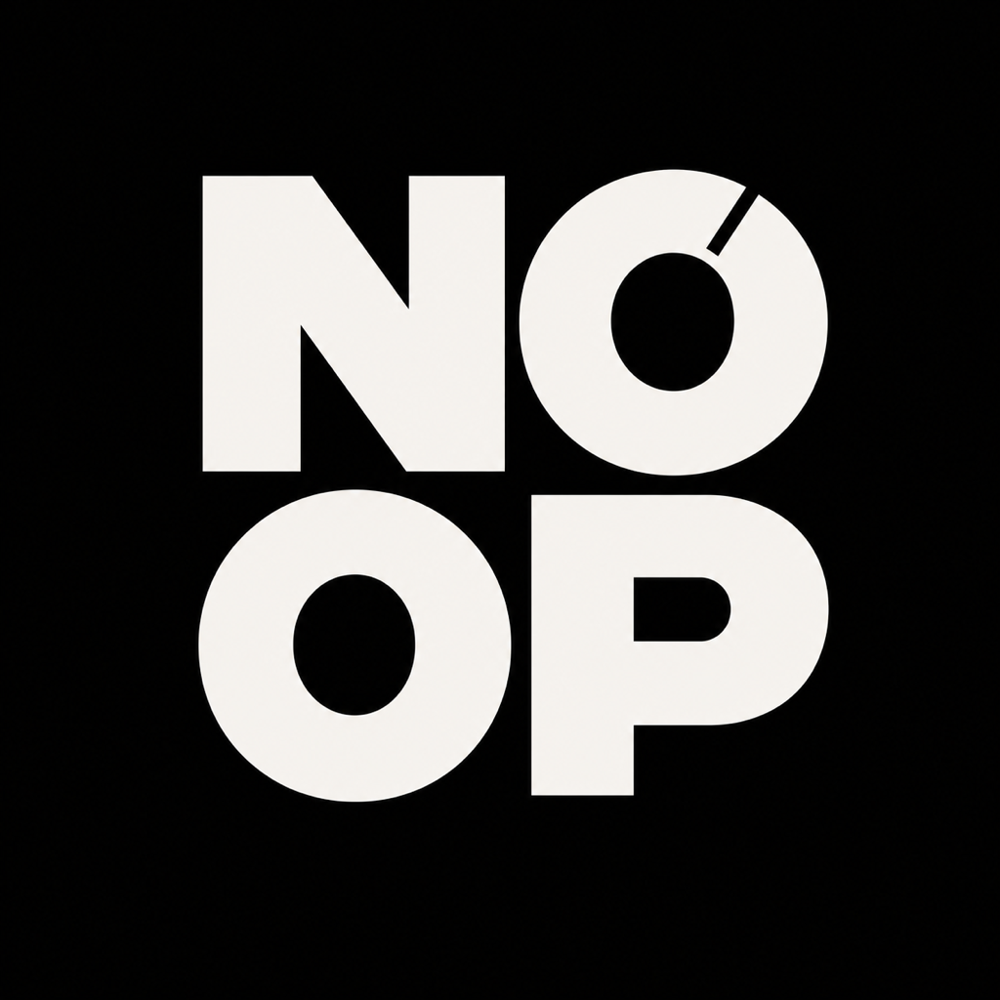
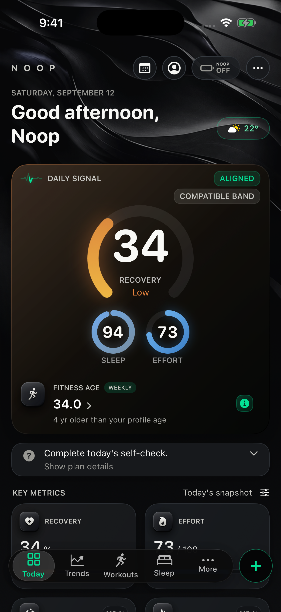
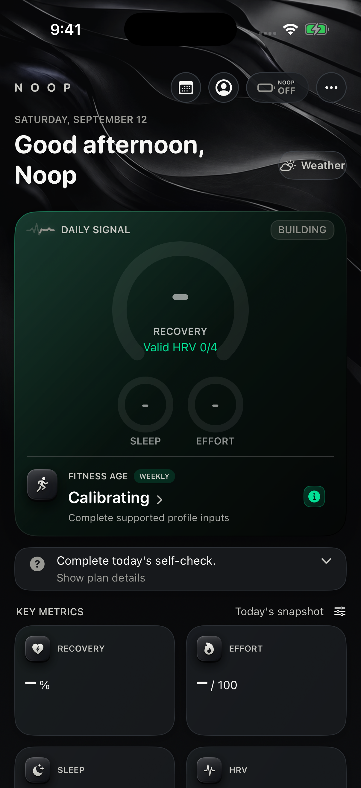
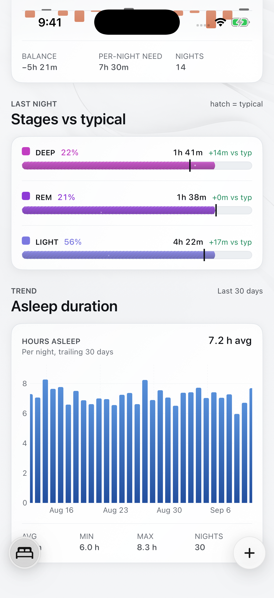
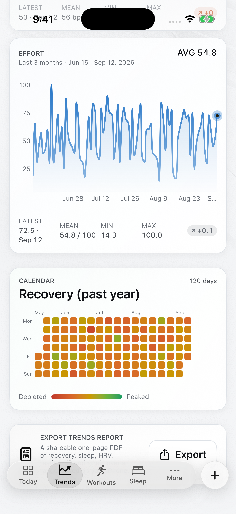

<p align="center">
  
</p>

<h1 align="center">NOOP</h1>

<p align="center">
  <strong>A local-first health, fitness, sleep, nutrition, and Safety companion.</strong>
</p>

<p align="center">
  NOOP turns wearable and phone signals into an explainable daily picture while
  keeping core collection, scoring, history, and export on the user's device.
</p>

<p align="center">
  <a href="#product-surfaces">Visuals</a> |
  <a href="#product">Product</a> |
  <a href="#build-and-run">Build</a> |
  <a href="#architecture">Architecture</a> |
  <a href="#privacy-and-safety">Privacy and safety</a> |
  <a href="#release-status">Release status</a> |
  <a href="docs/README.md">Documentation</a>
</p>

> [!IMPORTANT]
> NOOP is pre-release software. Source, tests, simulators, and synthetic staging
> do not prove physical-band behavior, background delivery, sensor accuracy,
> clinical validity, signing, or store readiness. See
> [Production readiness](docs/PRODUCTION_READINESS.md) and
> [Release blockers](docs/handoff/RELEASE-BLOCKERS.md).

## Product Surfaces

<table>
  <tr>
    <td width="50%" align="center">
      <a href="docs/assets/readme/ios-today.png">
        
      </a>
      <br>
      <sub><strong>Today.</strong> Deterministic synthetic demo data shows the daily signal, source labels, confidence, and key metrics.</sub>
    </td>
    <td width="50%" align="center">
      <a href="docs/assets/readme/ios-today-calibrating.png">
        
      </a>
      <br>
      <sub><strong>Honest states.</strong> Deterministic synthetic empty-state demo data intentionally retains Building, Calibrating, and missing values.</sub>
    </td>
  </tr>
  <tr>
    <td width="50%" align="center">
      <a href="docs/assets/readme/ios-sleep.png">
        
      </a>
      <br>
      <sub><strong>Sleep detail.</strong> A bottom-scroll capture with deterministic synthetic demo data visualizes stage context, sleep debt, and a 30-day trend without implying clinical validation.</sub>
    </td>
    <td width="50%" align="center">
      <a href="docs/assets/readme/ios-trends.png">
        
      </a>
      <br>
      <sub><strong>Trends detail.</strong> A bottom-scroll capture from the deterministic 120-day fixture shows range controls, calendar context, and export affordances.</sub>
    </td>
  </tr>
</table>

These are unretouched, full-resolution captures from the audited base commit
recorded in the [visual manifest](docs/assets/readme/manifest.json), not a claim
about the current dirty worktree. Android and macOS are not pictured because
this documentation slice did not produce deterministic captures for those
clients. The manifest records generalized capture commands, fixtures,
checksums, dimensions, and limitations.

## Product

NOOP is built around four questions:

1. What is my state today?
2. How confident is that reading?
3. What changed?
4. What is one useful thing I can do next?

The primary phone navigation is the same on iPhone and Android:

```text
Today | Trends | Workouts | Sleep | More
```

| Surface | Purpose |
|---|---|
| **Today** | Recovery, Sleep, Effort, Fitness Age, freshness, calibration, evidence, and one useful next action. |
| **Trends** | Long-range metric views, calendar navigation, comparisons, and source-aware history. |
| **Workouts** | Manual and reviewed activity sessions, live zones, routines, strength sets, goals, history, and personal records. |
| **Sleep** | Last-night summary, sleep history, planning, wake windows, editable sessions, and evidence-qualified detail. |
| **Journal and Coach** | Private journal and local memory, optional user-configured model transport, check-ins, and proposed actions that require confirmation before changing records. |
| **Nutrition and Hydration** | Editable meals, nullable nutrients, saved foods, hydration goals, exact entries, and accessible quick logging. |
| **Safety** | Opt-in paging to accepted NOOP contacts with incident status and optional latest-only location sharing. |
| **Friends** | Invitation-only, directional sharing with exact-match IDs, explicit field controls, removal, blocking, and receiver-controlled pokes. |
| **Data controls** | Imports, local backup, export, diagnostics, self-hosted sync, optional NOOP+, device revocation, and erasure. |

NOOP does not manufacture a score when evidence is absent. Missing input stays
missing; building, stale, partial, unsupported, and unavailable states remain
visible to the user.

## A Day With NOOP

```text
Wearable / Health API / import
              |
              v
       durable local storage
              |
              v
    source and quality checks
              |
              v
       on-device analytics
              |
              v
 Today / Sleep / Workouts / Trends
              |
              v
 evidence-qualified optional action
```

- **Morning:** explain sleep and recovery, show uncertainty, and offer a
  realistic plan rather than a judgment.
- **During the day:** surface at most one useful hydration, breathing,
  movement, journal, or recovery interruption when evidence is current and the
  exact preference is enabled.
- **During a workout:** show fresh heart rate and zones, keep ordinary coaching
  separate from Safety, and use cautious pause language rather than diagnosis.
- **Evening:** protect the selected sleep window, support a short journal
  check-in, and avoid repeated prompts after completion.
- **After a data gap:** keep the app interactive, explain freshness, and resume
  bounded catch-up without pretending that an animation completed the work.

See [Platform architecture](docs/PLATFORM_ARCHITECTURE.md) for the complete day
orchestrator and evidence contract.

## First-Run Flow

The matched Apple and Android onboarding sequence is:

```text
Welcome
  -> product and evidence expectations
  -> Bluetooth explanation
  -> wear and connect
  -> optional first-party ownership flow
  -> profile
  -> imports
  -> explicit notification choice
  -> optional Safety contacts
  -> appearance and daily rhythm
  -> NOOP or NOOP+ preference
  -> Today
```

App exploration, imports, local user records, and exports remain account-free.
A future first-party NOOP Band requires a narrow ownership account for initial
claim and replacement-phone authorization. Once activated, core collection,
scoring, history, export, and supported local control must continue without
NOOP+, payment, subscription, or continuous network access.

The production possession sequence remains hardware-dependent:

```text
match printed identifier
  -> identify vibration
  -> deliberate gesture on the worn band
  -> authenticated possession proof
  -> atomic single-owner claim
```

That sequence is not presented as implemented until the approved firmware,
supplier contract, neutral SDK adapters, and physical-device matrix exist.

## NOOP And NOOP+

| Capability | NOOP | NOOP+ |
|---|---:|---:|
| Local collection and storage | Yes | Yes |
| On-device metrics and history | Yes | Yes |
| Workouts, Journal, Coach, nutrition, and automations | Yes | Yes |
| Local backup and export | Yes | Yes |
| Managed multi-device storage and restore | No | Optional |
| Managed Friends and app Safety transport | No | Optional |
| Core operation during a cloud outage | Yes | Yes |

NOOP+ is a separate, explicit consent boundary. Selecting a preference does
not itself upload data, open checkout, grant entitlement, or turn ownership
identity into health-data consent. Public NOOP+ enrollment remains disabled
until production identity, client encryption and key recovery, physical
clients, operations, privacy, security, deletion, and recovery gates pass.

## Privacy And Safety

- Core health storage and analytics are local-first.
- AI Coach, cloud imports, self-hosted services, and NOOP+ are separate
  destinations. Each remains off until the user deliberately configures or
  consents to it.
- Calendar content is classified locally and discarded; event text is not
  placed in health notifications.
- Lock-screen notifications use private copy and do not expose scores, raw
  health values, journal content, event names, or precise location.
- Mobile diagnostics are bounded, local, user-initiated, and previewed before
  sharing. They do not include the health database.
- User reports may include optional context and an optional screenshot; neither
  is silently uploaded.
- Automatic medical, fall, rhythm, SpO2, temperature, stress, and wellness SOS
  paging is intentionally disabled.
- The first-release Safety target is manual, user-confirmed paging to accepted
  contacts. It is not emergency dispatch and cannot guarantee delivery or
  response.
- Shared Safety location is the newest approved point only, for a selected
  incident window, and is deleted at terminal lifecycle states.

NOOP is a general-wellness product, not a medical device. It does not diagnose
sleep apnea, disease, injury, dehydration, emergency state, or body
composition from unsupported signals. Read [DISCLAIMER.md](DISCLAIMER.md),
[Privacy and security](docs/PRIVACY_SECURITY.md), and
[Security policy](SECURITY.md).

## Platform Status

| Platform | Current source status |
|---|---|
| **iPhone** | Native SwiftUI app for iOS 17+, with widgets, Live Activities, Watch companion targets, HealthKit integration, and the five-destination phone shell. |
| **Android** | Native Kotlin and Jetpack Compose app for Android 8+, with Room, Health Connect, WorkManager, alarms, notifications, and matched product semantics. |
| **macOS** | SwiftUI reference and desktop management experience with a sidebar shell over the shared Apple data and analytics layers. |

Apple and Android use separate native implementations but share one behavioral
contract. Stored data, formulas, provenance, missing states, consent, and safety
boundaries must agree even when native rendering differs.

The repository still contains compatibility adapters and historical
provenance for third-party wearable development. They are independent,
experimental paths and must not be confused with production evidence for a
first-party NOOP Band.

## Build And Run

### Requirements

- macOS with a supported Xcode and the Swift toolchain
- XcodeGen for Apple project generation
- JDK 17 and the Android SDK for Android
- Python 3 for repository policy and operations tools
- A physical phone and supported hardware for BLE validation

### Apple

```bash
xcodegen generate

xcodebuild \
  -project Strand.xcodeproj \
  -scheme Strand \
  -destination 'platform=macOS' \
  CODE_SIGNING_ALLOWED=NO \
  build
```

For iPhone development, open the generated project, select `NOOPiOS`, choose
your own signing team, and use a device you are authorized to test.

### Android

```bash
cd android
./gradlew assembleFullDebug
./gradlew testFullDebugUnitTest
```

The APK is generated under `android/app/build/outputs/apk/full/debug/`.

### Shared Packages

```bash
swift test --package-path Packages/WhoopProtocol
swift test --package-path Packages/WhoopStore
swift test --package-path Packages/StrandAnalytics
swift test --package-path Packages/NoopRemoteSync
```

Package tests do not compile the application targets. App changes require the
corresponding Xcode or Gradle build. Builds and simulators do not validate BLE,
background execution, haptics, battery behavior, or physiological accuracy.

Detailed setup:

- [Build guide](docs/BUILD.md)
- [iOS guide](docs/IOS.md)
- [Android guide](docs/ANDROID.md)
- [Contributor guide](docs/CONTRIBUTING.md)
- [Controlled testing boundaries](docs/BETA_TESTING.md)

## Architecture

```text
Platform BLE / Health APIs / imports
                  |
                  v
          ingestion coordinator
                  |
          durable transaction
                  |
       +----------+-----------+
       |                      |
       v                      v
 local analytics       optional sync outbox
       |                      |
       v                      v
 bounded read models    resumable transfer
       |
       +--> Today / Sleep / Workouts / Trends
       |
       +--> guidance candidates and local notifications
```

```text
Packages/WhoopProtocol     Pure protocol parsing and framing
Packages/WhoopStore        GRDB/SQLite storage and migrations
Packages/StrandAnalytics   Pure health and fitness policies
Packages/StrandImport      File and health-data import
Packages/StrandDesign      Shared Apple design system
Packages/NoopRemoteSync    Optional self-hosted and managed clients

Strand/                    Shared Apple app and macOS shell
StrandiOS/                 iPhone lifecycle and navigation
StrandiOSWidgets/          Widgets and Live Activities
NOOPWatch*/                Watch companion targets
android/                   Android app, storage, analytics, and background work
server/                    Optional account, sync, Friends, and Safety services
Tools/                     Verification, localization, release, and QA gates
```

Core rules:

1. Durable data is committed before derived state or acknowledgement.
2. High-rate history is immutable and idempotent.
3. Long work is bounded, resumable, cancellable, and kept off the UI thread.
4. Missing input remains missing.
5. Every score retains source, formula revision, and explainable evidence.
6. Core local operation cannot depend on NOOP+ availability.
7. Safety transport cannot be entered by an ordinary wellness score.

Read [System architecture](docs/ARCHITECTURE.md),
[Platform architecture](docs/PLATFORM_ARCHITECTURE.md), and
[Data model](docs/DATA_MODEL.md).

## Release Status

This repository contains substantial implemented and tested product code, but
it is not a production-release claim.

The supplier-independent source currently includes:

- native Apple and Android product flows;
- local storage, imports, analytics, workouts, sleep, Journal, Coach,
  nutrition, hydration, diagnostics, backup, and export;
- optional managed-storage, Friends, and app Safety foundations;
- bounded observability and cross-platform policy gates;
- protected release controls and evidence tooling.

The following still require evidence outside normal source tests:

- final first-party band, firmware, GATT/wire contract, neutral SDK adapters,
  possession proof, manufacturing, certification, battery, history, and OTA;
- representative physical iPhone and Android matrices;
- sensor and metric validation with held-out participants and devices;
- production identity, encryption/key recovery, carrier/provider delivery,
  monitoring, recovery, and staffed operations;
- legal, privacy, terms, returns, payments, trademark, signing, and store
  approval;
- professionally reviewed launch localization and licensed exercise media.

No public release should be described as ready until the checked-in release
ledger and exact release commit prove every applicable gate.

## Contributing And Support

- [Contributing](CONTRIBUTING.md)
- [Engineering contributor guide](docs/CONTRIBUTING.md)
- [Support](SUPPORT.md)
- [Security](SECURITY.md)
- [Code of Conduct](CODE_OF_CONDUCT.md)
- [Current operations handoff](docs/ops/ACTIVE.md)

For an app problem, use the in-app shake-to-report flow when available. Review
the attachment list before sending and never post credentials, raw health
exports, precise location, or another person's data in a public issue.

## Documentation

| Question | Start here |
|---|---|
| What is implemented? | [Features](docs/FEATURES.md), [Production readiness](docs/PRODUCTION_READINESS.md) |
| How does it work? | [Architecture](docs/ARCHITECTURE.md), [Platform architecture](docs/PLATFORM_ARCHITECTURE.md) |
| Where is data stored? | [Data model](docs/DATA_MODEL.md), [Privacy and security](docs/PRIVACY_SECURITY.md) |
| How are metrics interpreted? | [Analytics](docs/ANALYTICS.md), [Validation](docs/validation/) |
| What blocks release? | [Release blockers](docs/handoff/RELEASE-BLOCKERS.md), [First-release checklist](docs/FIRST_PRODUCTION_RELEASE_CHECKLIST.md) |
| What is being worked on now? | [Active operations record](docs/ops/ACTIVE.md) |

The complete documentation index is [docs/README.md](docs/README.md).

## Independence, Attribution, And License

NOOP is independent and is not affiliated with or endorsed by third-party
wearable manufacturers. Third-party names in compatibility code, imports,
migrations, tests, and provenance identify the relevant source or device; they
do not imply sponsorship.

Do not add proprietary firmware, decompiled applications, credentials,
production keys, private health data, or supplier binaries to this repository.

The project is licensed under
[PolyForm Noncommercial 1.0.0](LICENSE). Dependency and historical attribution
is preserved in [NOTICE](NOTICE), [ATTRIBUTION.md](ATTRIBUTION.md), and the
runtime legal inventory.
